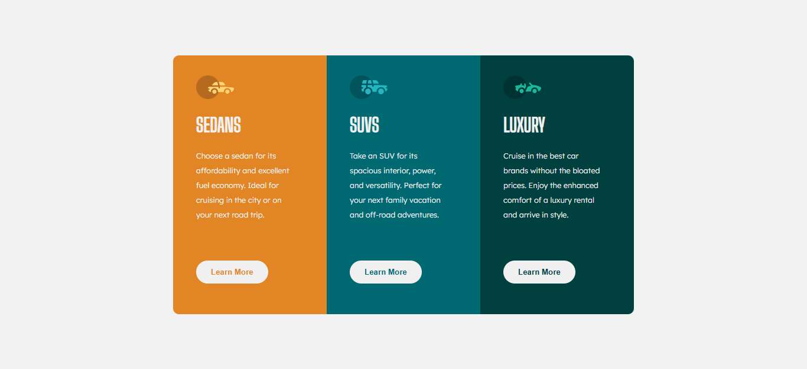

# Frontend Mentor - 3-column preview card component

This is a solution to the [3-column preview card component on Frontend Mentor](https://www.frontendmentor.io/challenges/3column-preview-card-component-pH92eAR2-).  
Frontend Mentor challenges help you improve your coding skills by building realistic projects.

---

## 📸 Screenshot

---

## 🔗 Links

- **Solution URL:** [https://www.frontendmentor.io/challenges/3column-preview-card-component-pH92eAR2-?tab=report](#)
- **Live Site URL:** [https://fransantos103.github.io/frontendMentorEasy-3-column-preview-card-component/](#)

---

## 💻 My process

### Built with
- Semantic **HTML5** markup  
- **CSS3** (Flexbox, custom fonts)  
- Responsive design principles  

---

## 🧠 What I learned

While working on this project, I reinforced my understanding of:
- Using **semantic HTML** (`<main>`, `<section>`)
- Creating **centered layouts** with Flexbox  
- Designing **consistent color palettes and hover effects**

Here’s a little code snippet I’m proud of:

To be honest, this challenge was easy. I didn’t find anything new, and I can be proud of having accomplished it.
